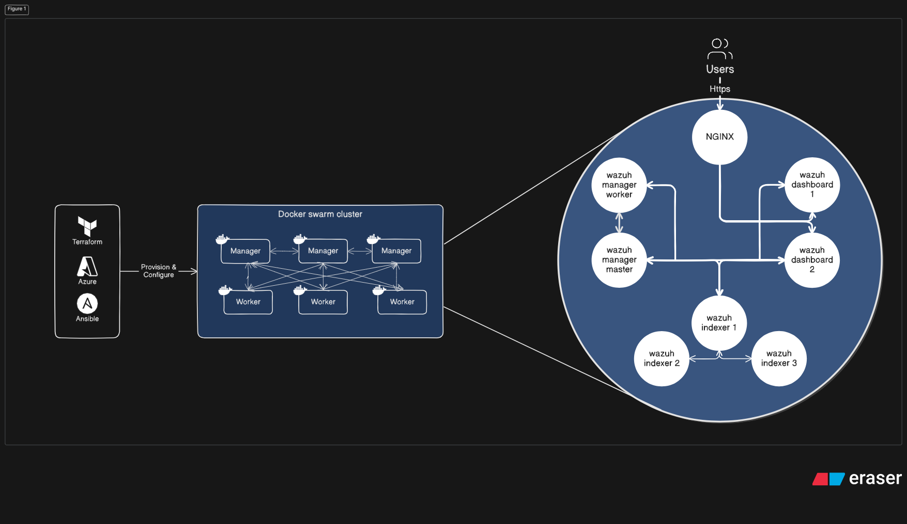
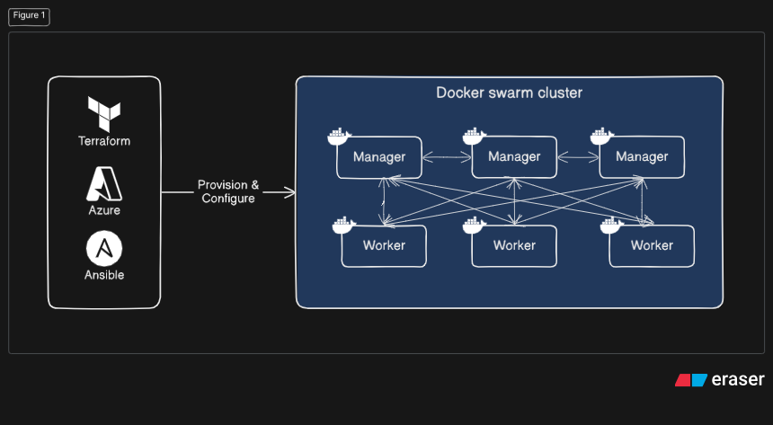
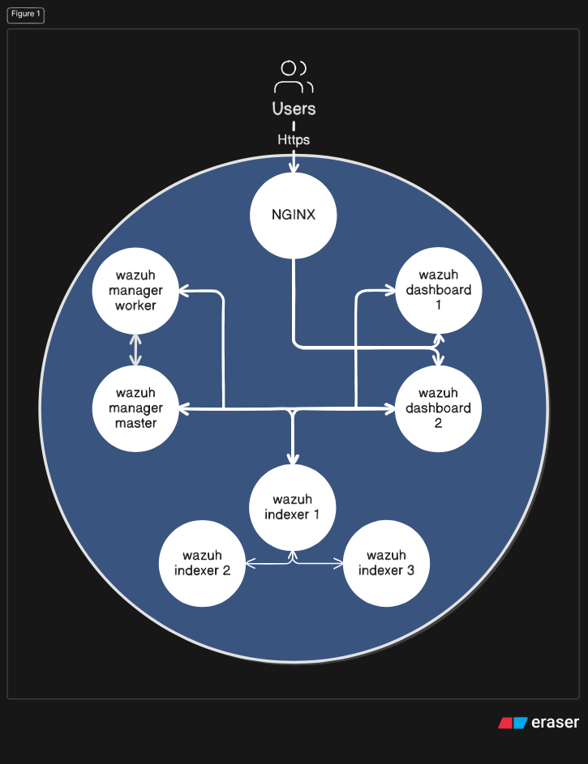
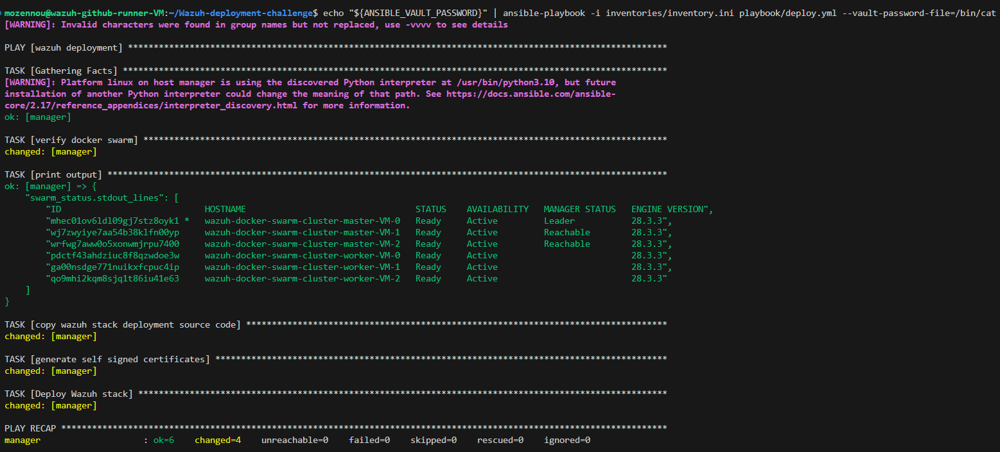
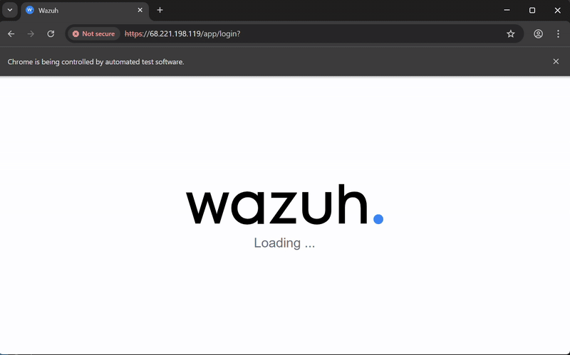
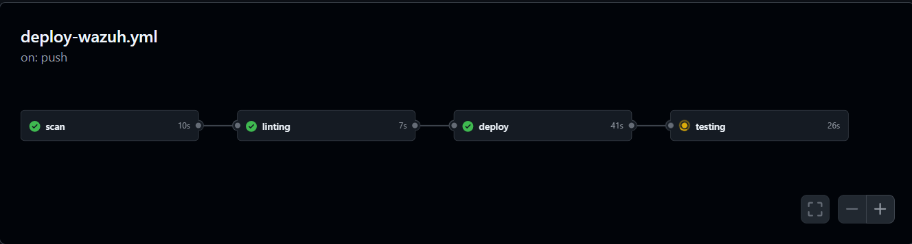
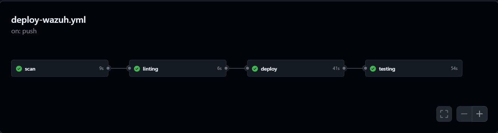
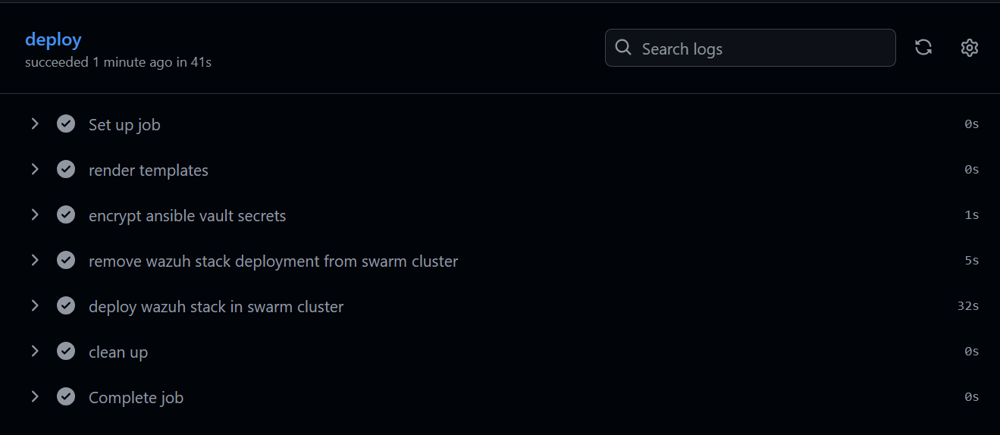

# Wazuh-deployment-challenge
Deployment of Wazuh stack in docker swarm cluster using Ansible and Github Actions.

> [!NOTE]  
> I’d like to inform you that I included some additional topics beyond the main subject, example of infra directories, because I believe they add value to the challenge. Thank you for your understanding.

### Completed Tasks
- [x] Infrastructure for Github self-hosted runner in Azure using Terraform & Ansible (additional).
- [x] Infrastructure for docker swarm cluster with multiple masters & workers in Azure using Terraform (additional + bonus).
- [x] Configure Wazuh stack multi node(with bonus):
    - Wazuh dashboard: ≥2 replicas behind Nginx as load balancer.
    - Wazuh manager: clustered deployment (master/worker).
    - Wazuh indexer (I’m facing multiple issues configuring ≥3 data nodes, and due to limited time I’m skipping it).
    - Nginx as reverse proxy & load balancer for Wazuh dashboard replicas.
- [x] Develop shell script for generating self signed certificates for Wazuh stack and Nginx.
- [x] Add healthchecks for wazuh stack(indexer, manager & dashboard) and nginx.
- [x] Develop Ansible playbook:
    - playbooks/deploy.yml:
        - ensure that docker swarm is initialized and list the nodes.
        - copy the wazuh stack deployment code to docker swarm leader manager.
        - run the self signed certificates script in docker swarm leader manager.
        - finally deploy Wazuh stack in the swarm cluster.
    - playbooks/teardown.yml
        - remove wazuh stack deployment from docker swarm cluster.
- [x] Develop testing script using python and selenium webdriver:
    - check if the wazuh dashboard is reachable over HTTPS.
    - authenticate with a non-admin user and check the login form and landing page elements.
- [x] Configure Github Actions workflow for:
    - scan the docker image used in wazuh stack & nginx using Trivy.
    - performe a linting check using yamllint.
    - deploy wazuh stack to docker swarm cluster using ansible playbook and save the secret in github encrypted secret + ansible vault.
    - testing health probe of the front-end api.
    - post-deployment testing using python script with selenium webdriver.
    
### Wazuh deployment architecture
In the diagram you will see the global architecture that I design, I use Terraform & Ansible to provision and configure both of Github self-hosted runner and Docker swarm cluster in Azure, using Ansible I configure the runner with required packages (ansible, trivy...), And also configure docker swarm cluster that composed of tree masters nodes and tree worker nodes that share the same azure virtual network for the communication:





finally the architecture of Wazuh stack that run in the previous docker swarm cluster composed from:
- Wazuh dashboard: ≥2 replicas behind Nginx as load balancer.
- Wazuh manager: clustered deployment (master/worker).
- Wazuh indexer (I’m facing multiple issues configuring ≥3 data nodes, and due to limited time I’m skipping it).
- Nginx as reverse proxy & load balancer for Wazuh dashboard replicas.

    

### Prerequisites
- provision and configure the infrastructure:
    - Github Action self-hosted runner in Azure [README.md](infra-github-runner/README.md)
    - Docker swarm cluster in Azure [README.md](infra-docker-swarm-cluster/README.md)
- setup all the required environment variables:
    ``` bash
    export ANSIBLE_VAULT_PASSWORD="<your-ansible-vault-password>"

    export INDEXER_USERNAME="<indexer-username>"
    export INDEXER_PASSWORD="<indexer-password>"

    export API_USERNAME="<api-username>"
    export API_PASSWORD="<api-password>"

    export DASHBOARD_USERNAME="<dashboard-username>"
    export DASHBOARD_PASSWORD="<dashboard-password>"

    export DOCKER_SWARM_MASTER_IP="<docker-swarm-master-ip>"
    export NGINX_VERSION="<nginx-version>"
    export WAZUH_VERSION="<wazuh-version>"
    ```
- render the templates:
    ``` bash
    export INDEXER_PASSWORD_HASH=$(bcrypt-tool hash ${INDEXER_PASSWORD})
    export DASHBOARD_PASSWORD_HASH=$(bcrypt-tool hash ${DASHBOARD_PASSWORD})

    cat group_vars/secrets.yml.sample | envsubst  > group_vars/secrets.yml
    cat inventories/inventory.ini.sample | envsubst > inventories/inventory.ini
    cat stack/config/wazuh_indexer/internal_users.yml.sample | envsubst > stack/config/wazuh_indexer/internal_users.yml
    ```
- generate ansible vault encrypted secrets:
    ``` bash
    echo "${ANSIBLE_VAULT_PASSWORD}" | ansible-vault encrypt group_vars/secrets.yml --vault-password-file=/bin/cat
    ```
- deploy wazuh stack:
    ``` bash
    echo "${ANSIBLE_VAULT_PASSWORD}" | ansible-playbook -i inventories/inventory.ini playbook/deploy.yml --vault-password-file=/bin/cat
    ```
- finally to remove the deployment:
    ``` bash
    ansible-playbook -i inventories/inventory.ini playbook/teardown.yml
    ```

### Screen shots
- ansible result output:

    

- python script testing recording with selenium webdriver:

    

- Github Actions workflow screen shots:

    

    

    
